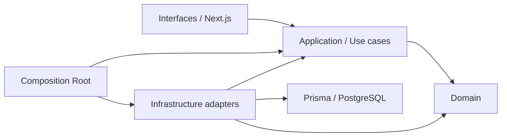

# AutomateX — Engineering and Architecture Handbook

Status: **Implemented**

Role: primary entry point for developers, reviewers and AI agents.

This document defines how work is performed in AutomateX. The repository and its executable tests
remain the evidence for implementation status; the documentation explains that evidence and must
be updated in the same change whenever architecture or behavior changes.

## Vision

AutomateX is a multi-tenant enterprise platform that converts validated company knowledge into
deterministic, explainable transformation decisions and, in V2, into abstract automation designs.
Business decisions come from domain engines and versioned catalogs, never from a language model.

AutomateX is an Enterprise Intelligence, Decision and Automation Engineering Platform. It is not a
generic low-code editor, workflow editor or AI chatbot. Every product capability must help an
organization understand, decide or act while preserving human control.

Long-term capabilities such as platform compilation, deployment, monitoring, optimization,
Marketplace, SDK, AI agents, Enterprise Simulator and partner tooling remain **Planned** unless the
canonical Project State explicitly marks them otherwise.

See [Product Vision](docs/product/PRODUCT_VISION.md) and
[Product Constitution](docs/product/PRODUCT_CONSTITUTION.md).

## Status vocabulary

Only these states are allowed in product and architecture documentation:

| State       | Meaning                                                                  |
| ----------- | ------------------------------------------------------------------------ |
| Implemented | Present in code, covered by the applicable tests and available as built. |
| In Progress | Partially implemented; missing parts are named explicitly.               |
| Planned     | Not implemented. It must not be presented as available.                  |

The canonical status matrix is [Project State](docs/PROJECT_STATE.md).

## Architecture

AutomateX uses bounded contexts, DDD and Clean Architecture:



Dependencies point inward. Domain imports no Application, Infrastructure, interface framework,
database client or other bounded context. Application orchestrates Domain through ports.
Infrastructure implements ports. Interfaces translate transport concerns only. Composition Roots
perform wiring only.

Read:

- [System Architecture](docs/architecture/SYSTEM_ARCHITECTURE.md)
- [Dependency Rules](docs/architecture/DEPENDENCY_RULES.md)
- [Data Access](docs/data-access.md)
- [Bounded Context Catalog](docs/enterprise/BOUNDED_CONTEXTS.md)

## DDD rules

- Business invariants belong to aggregates, Value Objects or Domain Services.
- Aggregate references across bounded contexts are identifiers or published contracts, not object
  imports.
- Published snapshots are immutable.
- Rebuild creates a new version when the relevant contract requires version lineage.
- Runtime input is validated before it enters the Domain.
- Domain events describe completed domain facts; they are persisted atomically through the outbox.
- Catalogs configure versioned decisions but never replace algorithms, invariants or lifecycle.

## CQRS rules

- Commands mutate one aggregate boundary within an explicit transaction.
- Queries never perform business transitions.
- Command and Query models are internal Application objects, not HTTP DTOs.
- Handlers orchestrate ports and Domain behavior; they contain no business rule.
- A read model may be optimized independently but cannot become a second source of business truth.

## Data, tenancy and security

- Supabase provides PostgreSQL, Auth and RLS.
- `supabase/migrations` is the source of truth for tables, constraints, triggers, grants and RLS.
- `prisma/schema.prisma` is the typed server projection.
- Every tenant-owned query carries `organization_id`.
- Authenticated Prisma work runs inside a transaction configured with the authenticated PostgreSQL
  role and user identity.
- Composite foreign keys protect tenant-scoped cross-record references where possible.
- Never use a service key to bypass authorization in a publicly reachable route.

See [Security Model](docs/security/SECURITY_MODEL.md).

## Transactions, idempotency and events

- Transaction boundaries are controlled by Application ports.
- Repository, outbox and idempotency writes for one command share one database transaction.
- Optimistic locking uses `lock_version`; stale mutations fail explicitly.
- Idempotency keys are scoped by tenant and command.
- The transactional outbox stores events before commit; external publication is separate.

## AI rules

The LLM may explain, summarize, reformulate or draft. It never makes a business decision, computes a
score, selects a recommendation, changes a lifecycle, or silently repairs invalid business data.
Deterministic engines and published catalogs own those responsibilities.

## Repository structure

```text
src/
  app/                         Next.js routes and pages
  components/                  reusable UI components
  infrastructure/              shared platform adapters
  modules/<bounded-context>/
    domain/
    application/
    infrastructure/
    composition/               when a context has explicit wiring
prisma/schema.prisma            typed database projection
supabase/migrations/            database source of truth
supabase/tests/                 pgTAP and RLS tests
docs/                           product and engineering source of truth
```

See [Repository Map](docs/reference/REPOSITORY_MAP.md).

## Coding conventions

- TypeScript strict; no `any` without a documented and reviewed exception.
- Prefer explicit names, short functions and immutable domain values.
- Validate unknown runtime data with Zod or Domain Value Objects.
- Do not put business logic in React, route handlers, Prisma mappers or SQL adapters.
- Use Prisma only in Infrastructure.
- Avoid duplicate rules and hidden constants.

See [Coding Standards](docs/development/CODING_STANDARDS.md) and
[Naming Conventions](docs/development/NAMING_CONVENTIONS.md).

## Test rules

Every significant change must preserve existing tests and add the lowest useful test:

- Domain unit tests for invariants and deterministic calculations;
- Application tests for orchestration, transactions and port usage;
- Infrastructure tests for adapters and serialization;
- API/component tests for interface behavior;
- pgTAP tests for constraints, lifecycle and RLS;
- architecture tests for forbidden dependency directions.

Required validation:

```bash
npm ci
npm run db:generate
npm run lint
npm run format:check
npm run typecheck
npm test
npm run build
supabase test db
```

See [Testing Guide](docs/development/TESTING_GUIDE.md).

## Workflow

1. Read `docs/PROJECT_STATE.md`, the relevant bounded-context document and applicable ADRs.
2. Confirm whether the requested capability is Implemented, In Progress or Planned.
3. Clarify missing business decisions; never invent them.
4. Work on a dedicated branch.
5. Implement in order: Domain, Application, Infrastructure, Interfaces, tests, documentation.
6. Run the full validation appropriate to the change.
7. Commit and push; do not merge without explicit authorization.

See [Git Workflow](docs/development/GIT_WORKFLOW.md),
[Review Process](docs/development/REVIEW_PROCESS.md) and
[Definition of Done](docs/development/DEFINITION_OF_DONE.md).

## Documentation policy

- Documentation changes accompany code changes in the same PR.
- Each important architecture decision receives an ADR.
- Frozen contracts are not rewritten silently.
- A detected divergence is recorded with evidence and a proposed correction; code is not changed
  solely to match documentation without approval.
- Links must be relative and valid.
- Mermaid is preferred when relationships are easier to understand visually.

## Documentation index

- [Documentation Home](docs/README.md)
- [Project Audit](docs/PROJECT_AUDIT.md)
- [Prioritized Next Steps](docs/NEXT_STEPS.md)
- [Architecture](docs/architecture/README.md)
- [Product](docs/product/README.md)
- [Development](docs/development/README.md)
- [Frontend](docs/frontend/README.md)
- [Enterprise](docs/enterprise/README.md)
- [API](docs/api/README.md)
- [Security](docs/security/README.md)
- [Testing](docs/testing/README.md)
- [Operations](docs/operations/README.md)
- [ADRs](docs/adr/README.md)
- [Reference](docs/reference/README.md)
