# AutomateX — Current Certified Status

Last verified: 2026-08-23.

This document is the current documentation source for AutomateX P0 consolidation status. Older
audit reports remain useful as historical evidence, but their verdicts must not be read as the
current release verdict unless this document explicitly references them.

## Release classification

| Area                                                 | Current classification | Notes                                                                                             |
| ---------------------------------------------------- | ---------------------- | ------------------------------------------------------------------------------------------------- |
| Auth, tenant and company access                      | CANONICAL              | Supabase Auth, tenant membership, local RLS and browser certification are current P0 foundations. |
| Discovery through Executive Result / Decision Center | CANONICAL              | The local canonical flow is certified through the P0 harness and downstream certification.        |
| Brain V2 and selected advanced AI reasoning          | SHADOW                 | Implemented for reasoning/lab/convergence work, not yet the sole production source of truth.      |
| Live and synthetic AI lab                            | SHADOW / LAB           | Useful for evaluation and realism work; not a production release gate by itself.                  |
| Automation Generator public delivery                 | PARTIAL / FUTURE       | Existing contracts and internals are not a certified public delivery path yet.                    |
| Runtime, deployment, monitoring and optimization     | PARTIAL / FUTURE       | Architecture and foundation work exist, but these are not the current certified product path.     |
| Agentic architecture and skills                      | FUTURE                 | Documentation-only target architecture; no production agent runtime is certified.                 |

## Current canonical flow

```mermaid
flowchart LR
  A["Auth"] --> T["Tenant"]
  T --> C["Company"]
  C --> AU["Audit"]
  AU --> D["Discovery"]
  D --> I["Interview"]
  I --> K["Enterprise Knowledge"]
  K --> PM["Process Map"]
  PM --> BA["Business Analysis"]
  BA --> AIO["AI Opportunities"]
  AIO --> AO["Automation Opportunities"]
  AO --> ROI["ROI Evaluation"]
  ROI --> RP["Recommendation Portfolio"]
  RP --> SB["Solution Blueprint"]
  SB --> AS["Automation Specification"]
  AS --> ER["Executive Result / Decision Center"]
```

## P0 consolidation evidence

| Commit   | Scope                                                         | SHA                                        |
| -------- | ------------------------------------------------------------- | ------------------------------------------ |
| Commit A | Automation Specification / canonical downstream consolidation | `ff640ce69c2fe35ba1bef42cb0eb5b4859d31499` |
| Commit B | Prisma and local Supabase safety                              | `fb94b177be99c361eec59cd4dc6b6dbcfb95ac62` |
| Commit D | Auth and session gate                                         | `5d6332ca16962282d656e9623fc574e17aa92cc5` |
| Commit C | Local P0 certification harness                                | `efb2f3f5e56cdc1b2b8fdd29b1f81a18fd7be8e0` |
| Commit E | Governance and skills                                         | `d8a3b8c6c3c460fc99fe0277cdc313e2654837c0` |

Certified local evidence:

- local canonical flow certified;
- 22 migrations in the current local certification chain;
- Prisma `validate` and `generate`: PASS;
- RLS / pgTAP: 236 / 236 PASS;
- Playwright pilot suite: 11 / 11 PASS, three consecutive full-suite runs;
- canonical downstream certified locally: ROI → Recommendation Portfolio → Blueprint →
  Specification → Executive Result.

## Still pending before production release

- exact-SHA staging certification against an isolated non-production deployment;
- production environment review without exposing or reusing staging secrets;
- final release PR review and merge authorization;
- production monitoring and operational acceptance;
- explicit decision on when, if ever, shadow Brain/AI capabilities become production authority.

## Documentation reading rule

If another document conflicts with this status, classify it as one of:

- `HISTORICAL SNAPSHOT — NOT CURRENT RELEASE VERDICT`;
- `FUTURE ARCHITECTURE — NOT IMPLEMENTED`;
- `SHADOW / LAB — NOT CURRENT CANONICAL PRODUCT PATH`;
- `LEGACY — KEPT FOR COMPATIBILITY OR CONTEXT`.

Do not infer production readiness from implementation existence alone.
