# AutomateX Branch Inventory

Status: **Implemented**

Inventory date: 2026-07-28  
Repository: `https://github.com/kraos026/Taratra.git`  
Reference: `origin/main` at `c99f6d4c4f3dcd97b6f63eeacae77d77625799c0`

## Scope and method

An active branch is a branch still published under `origin/*`. Local branches whose upstream has
been deleted are archival references and are not baseline candidates. `Ahead` and `Behind` are
commit counts relative to `origin/main`. A branch whose commits are patch-equivalent to `main` is
classified as integrated even when its original SHA is not an ancestor.

## Published branches

| Branch                                       | HEAD                                       | Total | Ahead | Behind | Objective                                                                   | State                                                                      | Dependencies                                                  | Risk                                                                                                                                                       |
| -------------------------------------------- | ------------------------------------------ | ----: | ----: | -----: | --------------------------------------------------------------------------- | -------------------------------------------------------------------------- | ------------------------------------------------------------- | ---------------------------------------------------------------------------------------------------------------------------------------------------------- |
| `main`                                       | `c99f6d4c4f3dcd97b6f63eeacae77d77625799c0` |    73 |     0 |      0 | Production integration line                                                 | Current remote baseline                                                    | None                                                          | **High**: seven direct documentation commits after the last reviewed merge; `docs/product` is a file while the documentation branch uses it as a directory |
| `docs/automation-generator-architecture`     | `805d2b491113b8f6c11882dc3610a5dd70116c56` |    70 |     4 |      7 | Freeze Automation Generator architecture on top of Automation Specification | Superseded by the cumulative documentation branch                          | Automation Specification commits                              | Medium: stacked and behind `main`                                                                                                                          |
| `docs/enterprise-foundation`                 | `92b4927a4d2ea497f3586e487e3a11823170f858` |    76 |    10 |      7 | Complete Generator stack plus enterprise documentation and project audit    | **Primary baseline candidate**                                             | All preceding Automation Specification and Generator branches | **High**: merge conflict in `AUTOMATEX_CODEX.md` and file/directory conflict at `docs/product`                                                             |
| `feat/automation-specification-engine`       | `e27f6f7c5d491f3cd701adcc18abe65f51c7756f` |    69 |     3 |      7 | Versioned Automation Specification bounded context and review corrections   | Implemented, not integrated                                                | Solution Designer published blueprint                         | Medium: schema/API/RLS change; stacked                                                                                                                     |
| `feat/automation-generator-domain`           | `da468d72662e3e96d411ca646c68bb0da0bba2a2` |    71 |     5 |      7 | Generator domain, graph, provenance and catalog model                       | Implemented, not integrated                                                | Specification Engine and frozen Generator architecture        | Medium: frozen domain contract                                                                                                                             |
| `feat/automation-generator-application`      | `286844aa3155a07d637bae65e661a5d9f267baae` |    72 |     6 |      7 | CQRS use cases and application ports                                        | Implemented, not integrated                                                | Generator Domain                                              | Medium: transaction/idempotency orchestration                                                                                                              |
| `feat/automation-generator-infrastructure`   | `68d8884fa1a7dc2765282217ada5490f10f32970` |    73 |     7 |      7 | Prisma, transaction, outbox and idempotency adapters                        | Implemented, not integrated                                                | Generator Application                                         | High: persistence migration and RLS                                                                                                                        |
| `feat/automation-generator-composition-root` | `afe6c17e4db8d37f623d2df4b9abb7475c7ac8cc` |    74 |     8 |      7 | Dependency injection and composition root                                   | Implemented, not integrated                                                | Generator Infrastructure                                      | Medium: wiring completeness                                                                                                                                |
| `feat/enterprise-simulator-architecture`     | `e03b4d25f3e88da739cba7ee8a634cd9e9332ff3` |    69 |     3 |      7 | Simulator architecture, public contracts and implementation roadmap         | Draft PR #21; documentation-only/planned tool                              | Stable AutomateX public contracts                             | Medium: sibling history, not part of runtime baseline                                                                                                      |
| `feat/companies-module`                      | `e9f9d81a5f0bc860116067277170854493ccd49f` |    13 |     0 |     60 | Companies module                                                            | Integrated and stale                                                       | Foundations                                                   | Low; safe archival candidate                                                                                                                               |
| `feat/process-mapping-engine`                | `28cc8d44172b098cd44922a8f63ab4d46ffeb9ed` |    45 |     0 |     28 | Process Mapping Engine                                                      | Integrated and stale                                                       | Enterprise Knowledge                                          | Low; safe archival candidate                                                                                                                               |
| `feat/discovery-engine`                      | `d2369b705cf387f8637168a6a7a4cbaf9bf0f3c1` |    37 |     1 |     37 | Discovery and architecture alignment                                        | Functional content integrated; unique commit is patch-equivalent to `main` | Companies                                                     | Low; stale documentation branch                                                                                                                            |
| `feat/solution-designer`                     | `2ff655595089b136aa937e05c0c5a5542a14fb74` |    61 |     2 |     14 | Solution Designer review and invariant corrections                          | Functional content integrated by equivalent commits in `main`              | Recommendation, ROI, Automation Opportunity                   | Low if archived; do not merge                                                                                                                              |
| `revert-18-feat/solution-designer`           | `120d39c8d3e9e57b950cde32294b47ca8e767458` |    61 |     0 |     12 | Temporary revert of Solution Designer                                       | Historical only                                                            | PR #18 history                                                | High if reused; archive                                                                                                                                    |
| `revert-19-revert-18-feat/solution-designer` | `78951a356c31bbce8e9c0a698d18190576528813` |    63 |     1 |     11 | Reapply Solution Designer                                                   | Patch-equivalent to `main`; historical only                                | Revert branch                                                 | High if merged; archive                                                                                                                                    |

`Total` is the number of commits reachable from the branch HEAD, not the number of branch-specific
commits. Branch-specific work is represented by `Ahead`.

## Actual dependency chain

The ten commits absent from `origin/main` on the primary baseline candidate form one linear stack:

```mermaid
flowchart LR
  A["2ae90f1 Architecture contract"] --> B["e11f5a8 Specification Engine"]
  B --> C["e27f6f7 Specification corrections"]
  C --> D["805d2b4 Generator architecture"]
  D --> E["da468d7 Generator Domain"]
  E --> F["286844a Generator Application"]
  F --> G["68d8884 Generator Infrastructure"]
  G --> H["afe6c17 Composition Root"]
  H --> I["8c1ed60 Enterprise documentation"]
  I --> J["92b4927 Project audit"]
```

The intermediate branches are checkpoints in this stack, not independent merge candidates.

## Pull requests and CI

- PR #21 is the only open pull request. It is draft, targets `main`, and both `quality` and
  `database-security` are green at `e03b4d2`.
- Every unique runtime commit in the primary stack has green `quality` and `database-security`
  checks. The architecture-only commit `2ae90f1` has no direct check run, but every tested
  descendant includes its content.
- `docs/enterprise-foundation` is not currently represented by an open pull request.

## Local archival branches

Several local branches report a deleted upstream, including historical Foundation, Audit,
Knowledge, Analysis, AI, Automation Opportunity, ROI, Recommendation and release-hardening
branches. They were excluded from active integration scope. They may be removed locally only after
the baseline tag exists and only with explicit approval.

## Inventory conclusion

The repository does not yet have a unique reproducible baseline. `origin/main` contains the stable
V1/V2 Solution Designer history, while the Automation Specification, Automation Generator and
enterprise documentation are held in a cumulative branch seven commits behind it. The baseline
must reconcile these two lines without squashing or rewriting the frozen architecture history.
