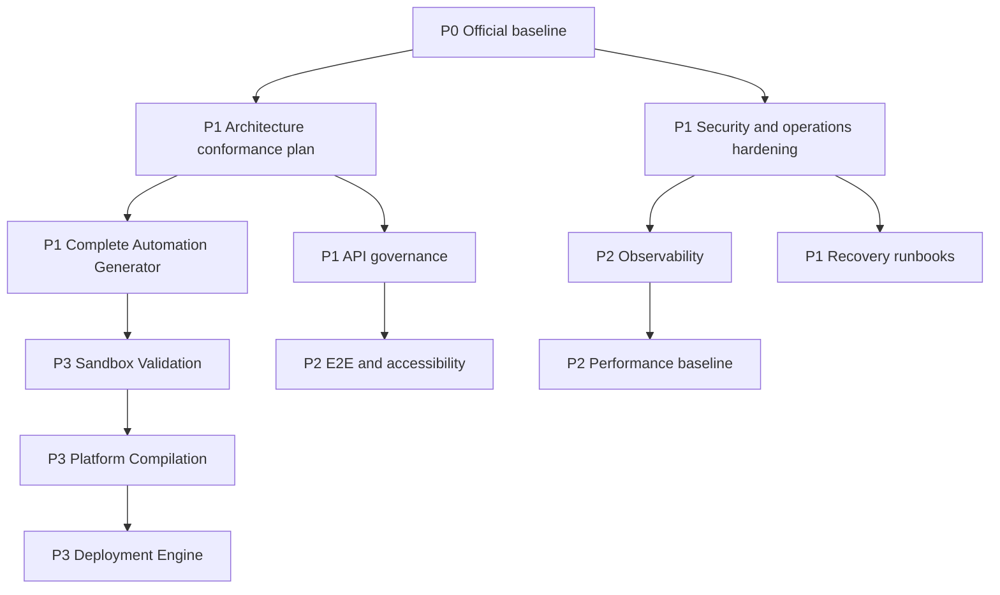

# AutomateX — Next Steps

Status: **Planned**

This roadmap is derived from [`PROJECT_AUDIT.md`](PROJECT_AUDIT.md). It does not authorize
implementation. Each step requires scope validation before code changes.

## Priority model

- **P0**: blocks a reliable official baseline.
- **P1**: required before broader Enterprise/public production use.
- **P2**: required for predictable scale and long-term maintainability.
- **P3**: future product expansion.

## Dependency map

## P0 — Establish the official baseline

### Step 1 — Reconcile stacked V2 and documentation branches

Objective:

- compare all commits from Automation Specification through this documentation audit with
  `origin/main`;
- confirm PRs, review state and correct merge order;
- ensure migrations are applied in chronological dependency order;
- merge only after explicit approval.

Dependencies: none.

Prerequisites:

- identify the owning PR for each commit group;
- re-run quality and database-security against the final merge candidate;
- confirm frozen architecture SHAs remain reachable.

Risks:

- merge conflicts in Prisma schema and migrations;
- documentation may overstate `main` until integration;
- partial merge can leave Composition depending on absent Infrastructure.

Acceptance evidence:

- one reviewed baseline commit on `main`;
- all expected V2 files present;
- CI green from the merge candidate;
- `PROJECT_STATE.md` matches `main`.

## P1 — Architecture conformance

### Step 2 — Create a bounded-context conformance matrix

Objective:

- inventory Domain/Application/Infrastructure/Presentation dependencies for every context;
- classify deviations without changing behavior;
- approve a migration order.

Dependencies: Step 1.

Prerequisites:

- frozen behavior and API compatibility requirements;
- ownership of legacy Rules/ROI/Recommendations.

Risks:

- broad refactoring can destabilize mature behavior;
- introducing ports everywhere at once creates unnecessary churn.

Recommendation: migrate one bounded context at a time, starting with a small but representative
context. Automation Generator remains the reference implementation.

### Step 3 — Validate all persisted JSON at runtime

Objective:

- inventory every Prisma JSON read;
- attach a Zod schema or Domain Value Object parser;
- reject malformed persisted data explicitly;
- remove unvalidated casts only after contract tests exist.

Dependencies: Steps 1 and 2.

Prerequisites:

- catalog and snapshot JSON contracts;
- compatibility strategy for legacy rows.

Risks:

- existing data may not satisfy newly explicit schemas;
- silent coercion would hide rather than solve incompatibility.

### Step 4 — Establish API governance

Objective:

- inventory all 88 routes;
- standardize auth, tenant context, errors, pagination, filtering and optimistic-lock conflicts;
- define OpenAPI generation/versioning strategy;
- define idempotency and correlation headers for mutating APIs.

Dependencies: Step 1; informed by Step 2.

Prerequisites:

- no breaking API change without a compatibility decision;
- identify external consumers.

Risks:

- accidental behavior change in historical APIs;
- one generic abstraction may not fit all lifecycle errors.

### Step 5 — Security and dependency hardening

Objective:

- validate the compatible Prisma update that resolves current moderate advisories;
- create an automated RLS/table coverage report;
- define rate limiting, abuse protection and security headers;
- document secret rotation and privileged-operation policy.

Dependencies: Step 1.

Prerequisites:

- staging validation;
- threat model for public APIs and future execution features.

Risks:

- dependency upgrade regression;
- false confidence from static RLS counting where migrations use dynamic SQL.

### Step 6 — Production recovery foundations

Objective:

- write deployment, rollback, backup, restore and incident runbooks;
- test restore into an isolated environment;
- define RPO/RTO and ownership.

Dependencies: Step 1.

Prerequisites:

- selected production hosting model;
- Supabase backup capabilities and retention policy;
- incident contacts and access model.

Risks:

- an untested runbook is not recovery evidence;
- tenant data handling requires audit and privacy controls.

## P1 — Complete the current product capability

### Step 7 — Finish Automation Generator

Objective:

- implement the deterministic `GenerationCompiler`;
- persist and rehydrate complete canonical graphs with validated codecs;
- add integration and PostgreSQL tests;
- add REST only after API governance decisions are approved.

Dependencies: Steps 1, 3 and 4.

Prerequisites:

- frozen AG-2B compiler contract;
- published Generation Rule Catalog adapter;
- deterministic content-hash canonicalization contract.

Risks:

- compiler behavior can accidentally encode platform-specific decisions;
- graph persistence can lose Value Object/runtime invariants;
- REST work before API governance creates another inconsistent interface.

## P2 — Quality, observability and scale

### Step 8 — Add measurable test governance

Objective:

- establish coverage reporting and thresholds by layer;
- add representative E2E journeys;
- add accessibility regression checks;
- add cross-context contract tests.

Dependencies: Steps 1 and 4.

Prerequisites:

- stable test data and local environment;
- approved critical user journeys.

Risks:

- global coverage percentage can incentivize low-value tests;
- brittle UI tests can slow delivery without improving confidence.

### Step 9 — Introduce observability standards

Objective:

- propagate correlation IDs;
- add structured tracing, metrics and centralized error reporting;
- define redaction and tenant-safe log fields;
- define service-level indicators.

Dependencies: Steps 4, 5 and 6.

Prerequisites:

- selected telemetry provider;
- data retention and privacy rules.

Risks:

- logs can leak tenant or secret data;
- uncontrolled metric cardinality can increase cost.

### Step 10 — Establish performance baselines

Objective:

- benchmark critical engine builds, report reads and list endpoints;
- capture representative query plans;
- define latency and query-count budgets;
- add load tests for agreed traffic profiles.

Dependencies: Step 9.

Prerequisites:

- representative anonymized datasets;
- target concurrency and service objectives.

Risks:

- premature optimization without production-shaped data;
- benchmark environments that do not resemble production.

### Step 11 — Controlled maintainability improvements

Objective:

- decompose the largest files only where responsibilities are demonstrably mixed;
- document Prisma schema ownership by bounded context;
- define deprecation/retention for historical Rules, ROI and Recommendations.

Dependencies: Step 2 and stable tests from Step 8.

Prerequisites:

- no behavior change;
- architecture review for any boundary movement.

Risks:

- cosmetic refactoring without measurable benefit;
- breaking historical consumers.

## P3 — Future Execution Platform

The following remain Planned and must not start before the P0/P1 foundations:

1. Sandbox Validation;
2. platform-specific compilation;
3. controlled Deployment Engine;
4. Monitoring Engine;
5. Optimization Engine;
6. Enterprise Simulator implementation.

Each requires a frozen architecture contract, threat model, tenant model, lifecycle, rollback
strategy and operational ownership.

## Recommended next step

The recommended next step is **Step 1 — Reconcile stacked V2 and documentation branches into one
reviewed official baseline**.

Justification:

- every later decision depends on knowing what `main` actually contains;
- the current audited branch is nine commits ahead of `origin/main`;
- migrations, documentation status and future branches can diverge if work continues now;
- reconciliation changes governance state, not product behavior.

No merge or implementation should occur until the commit groups and PR order are explicitly
approved.
