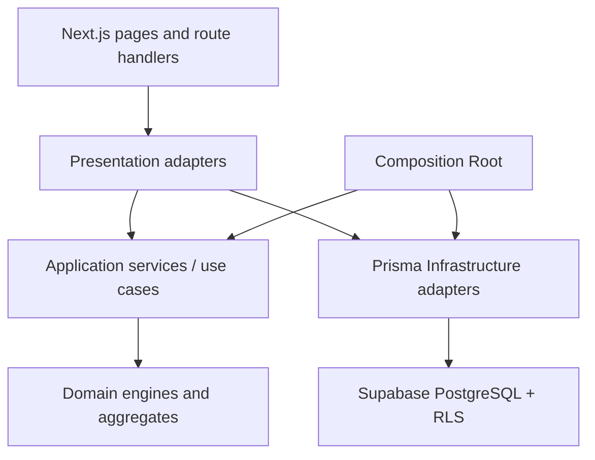

# AutomateX — Project Audit

Status: **Implemented**

Audit date: 2026-07-28  
Audited branch: `docs/enterprise-foundation`  
Audited baseline before this report: `8c1ed605fffee7aa712838aef7930fb246f20332`  
`origin/main` at audit time: `c99f6d4c4f3dcd97b6f63eeacae77d77625799c0`

## 1. Executive assessment

AutomateX is a substantial, tested multi-tenant platform with deterministic business engines,
versioned snapshots, PostgreSQL RLS and a disciplined V2 architecture. The V1 Enterprise
Intelligence chain is broad and the recent Automation Generator work demonstrates a stronger Clean
Architecture implementation than several historical contexts.

The platform is not yet operationally mature enough to be called a complete Enterprise execution
platform. Its principal gaps are governance of the Git baseline, inconsistent dependency inversion
across older bounded contexts, incomplete runtime validation of persisted JSON at some
Infrastructure boundaries, absence of full E2E/performance/observability practices, and missing
production runbooks.

Overall maturity: **3/5 — engineered product with Enterprise foundations, not yet an
operationally complete Enterprise platform**.

## 2. Audit scope and evidence

The audit inspected:

- 20 module directories under `src/modules`;
- 88 API route files and 27 page files;
- 114 Prisma models and 46 Prisma enums;
- 19 Supabase migrations;
- 146 statically declared PostgreSQL policies;
- 71 Vitest files containing 320 passing tests;
- 17 pgTAP files;
- GitHub Actions `quality` and `database-security`;
- dependency direction, runtime casts, repository wiring and documentation;
- current package vulnerability report.

The static RLS count does not by itself prove coverage because several migrations enable RLS with
dynamic SQL loops. The successful `database-security` job and pgTAP suite are the stronger evidence.

## 3. Baseline and release governance

### Finding G-01 — branch state differs from `main`

The audited branch contains nine commits absent from `origin/main`:

- Automation Specification architecture and implementation;
- Automation Generator architecture;
- Automation Generator Domain, Application, Infrastructure and Composition;
- Enterprise documentation foundation.

Therefore:

- these capabilities are **Implemented on the audited branch**;
- they are **not yet integrated into `origin/main`**;
- documentation must not describe them as part of the official `main` release until the relevant
  PRs are reviewed and merged.

Risk: **Critical**. Parallel work from `main` can omit or conflict with the V2 stack, while reports
from the feature branch can overstate the official baseline.

Required response: reconcile and approve the stacked branch history before starting another
bounded context.

## 4. Current architecture

The intended direction is Interfaces/Composition → Application → Domain, with Infrastructure
implementing Application ports. This direction is fully explicit in Automation Generator but only
partially applied in older contexts.

### Canonical business chain

```mermaid
flowchart LR
  D["Discovery"] --> INT["Interview"]
  D --> K["Enterprise Knowledge"]
  INT --> K
  K --> PM["Process Mapping"]
  PM --> BA["Business Analysis"]
  BA --> AI["AI Opportunity"]
  AI --> AO["Automation Opportunity"]
  AO --> ROI["ROI"]
  ROI --> REC["Recommendation"]
  REC --> SD["Solution Designer"]
  SD --> AS["Automation Specification"]
  AS --> AG["Automation Generator"]
```

The chain through Automation Specification is Implemented on the audited branch. Automation
Generator is In Progress because real graph compilation and REST interfaces are Planned.

## 5. Layer maturity

| Layer/concern    | Maturity | Evidence and limits                                                                |
| ---------------- | :------: | ---------------------------------------------------------------------------------- |
| Domain           |   4/5    | deterministic engines, invariants, immutable objects; some very large domain files |
| Application      |   3/5    | services/use cases tested; many historical services type-depend on Prisma adapters |
| Infrastructure   |   3/5    | Prisma, RLS transactions and repositories; JSON validation consistency varies      |
| Presentation/API |   3/5    | 88 routes and common envelopes; no complete OpenAPI/versioning/rate-limit contract |
| Composition      |   2/5    | explicit and tested for Generator; manual construction dominates other contexts    |
| Persistence      |   4/5    | 114 models, migrations, constraints, versioning, RLS and pgTAP                     |
| Frontend         |   3/5    | substantial responsive UI; large components and incomplete design-system catalog   |
| Testing          |   3/5    | strong unit/pgTAP CI; no coverage threshold or first-class E2E suite               |
| Security         |   3/5    | Auth, authorization and RLS; operational controls remain incomplete                |
| Observability    |   1/5    | structured console logger only; no tracing, metrics or centralized error service   |
| Operations       |   2/5    | reproducible CI/local stack; no production/backup/incident runbooks                |
| Documentation    |   3/5    | foundation and ADRs exist; engine/API/reference consolidation remains In Progress  |

## 6. Architecture strengths

### DDD and determinism

- Business engines are explicit and deterministic.
- LLMs are excluded from business decisions.
- V1/V2 boundaries use published or ready snapshots.
- Provenance, catalog versions and evidence are first-class data in mature contexts.
- Automation Generator has strong Value Objects, lifecycle tests and a pure canonical graph model.

### Versioning and concurrency

- Important aggregates use version numbers and `lock_version`.
- Published records are generally protected by aggregate behavior and PostgreSQL triggers.
- Rebuild semantics are explicit in the later bounded contexts.

### Data and tenancy

- Supabase migrations are the schema source of truth.
- Prisma provides typed server access.
- Authenticated transactions adopt PostgreSQL's `authenticated` role.
- Composite tenant references and RLS are widely used.
- Database security runs independently in CI.

### Quality automation

The `quality` job executes clean installation, Prisma generation, lint, format, typecheck, Vitest
and build. The `database-security` job starts Supabase and runs pgTAP.

## 7. Architecture weaknesses and technical debt

### A-01 — Application depends on concrete Infrastructure types

At least the following Application services import concrete `Prisma...Repository` types:

- audits;
- AI opportunities;
- questionnaires;
- process mapping;
- Enterprise Knowledge;
- business analysis;
- interviews;
- automation opportunities;
- Discovery;
- ROI evaluations;
- reports;
- recommendations and recommendation portfolios;
- rules.

Rules and questionnaires also import `OrganizationRole` from the generated Prisma client.

Impact:

- Dependency Inversion is violated.
- Unit tests require Infrastructure-shaped fakes.
- replacing Prisma or reusing a use case outside the current runtime is harder.

Automation Generator demonstrates the target: Application-owned ports and Infrastructure-owned
implementations.

### A-02 — manual composition in Presentation

Most Presentation adapters construct Prisma repositories and services directly. This is functional
but spreads composition responsibility across many files and makes provider completeness,
request-scoped context and lifecycle configuration difficult to audit.

### A-03 — runtime JSON validation is inconsistent

Several Prisma repositories contain `as unknown as` conversions for JSON catalog, topology,
calculation, provenance or blueprint data. Some values may be validated later by Domain factories,
but the repository boundary does not make that guarantee uniformly explicit.

Affected areas include Solution Designer, Process Mapping, Automation Specification, Business
Analysis, ROI, AI and Recommendation persistence.

Risk: malformed or legacy database JSON can reach application/domain code with a compile-time type
that has not been proven at runtime.

### A-04 — large files and mixed responsibilities

Examples include:

- questionnaire pages: approximately 586 lines;
- Discovery wizard: approximately 495 lines;
- Business Analysis engine: approximately 401 lines;
- several Prisma repositories: 300–392 lines;
- Automation Specification engine: approximately 391 lines.

Large size alone is not a defect, but it increases review cost and the risk of mixing mapping,
querying, validation and orchestration.

### A-05 — legacy and canonical engines coexist

Historical Rules, ROI and Recommendations remain for compatibility while V1 canonical replacements
also exist. Their boundary is documented, but the repository lacks a complete deprecation and data
retention strategy.

### A-06 — Prisma schema concentration

The single Prisma schema represents 114 models and 46 enums. It remains valid, but ownership and
review become progressively harder as new contexts arrive.

## 8. Security assessment

### Strengths

- Supabase Auth and server-side user validation;
- authenticated Prisma transactions;
- role-aware services;
- RLS and explicit grants;
- tenant filters and composite constraints;
- pgTAP isolation tests;
- no detected direct Prisma access from route files;
- no service-role authorization pattern found in application source.

### Risks

| Risk                                                         | Severity | Assessment                                                                 |
| ------------------------------------------------------------ | -------- | -------------------------------------------------------------------------- |
| Git baseline ambiguity can bypass reviewed security changes  | Critical | V2 migrations are not in `main`                                            |
| Inconsistent JSON runtime validation                         | High     | persisted data may be trusted through casts                                |
| No global rate limiting/abuse protection contract            | High     | important before public Enterprise exposure                                |
| No centralized tracing/correlation propagation               | Medium   | incident investigation is limited                                          |
| No automated proof that every new public table has RLS tests | Medium   | current pgTAP is strong but manually curated                               |
| Dependency advisories                                        | Medium   | `npm audit --omit=dev` reports four moderate advisories via Prisma tooling |
| Production backup/restore and incident procedures absent     | High     | operational recovery is undocumented                                       |

The dependency report indicates a compatible Prisma `7.9.1` fix is available. Upgrade validation is
Planned; no dependency was changed during this audit.

## 9. Quality and testability

### Implemented

- strict TypeScript;
- ESLint with zero warnings;
- Prettier checks;
- 320 passing Vitest tests across 71 files;
- 17 pgTAP files;
- architecture tests in several recent contexts;
- build and database security in CI.

### Missing or incomplete

- no configured coverage thresholds or trend reporting;
- no repository-wide dependency graph test;
- no first-class Playwright/Cypress E2E command;
- no automated accessibility regression suite;
- no contract-test suite for all cross-context public readers;
- no mutation testing for critical deterministic formulas;
- no load/performance test baseline.

The current tests provide strong functional confidence but do not quantify untested lines, complete
user journeys or operational behavior under load.

## 10. Performance assessment

No confirmed N+1 defect was proven by this static audit. Later repositories often batch independent
reads with `Promise.all`, which is positive. However:

- several detail loaders hydrate complete child collections;
- no query budget, explain-plan evidence or load benchmark is checked in;
- 88 routes lack documented latency/service-level objectives;
- no production metrics exist to validate database and rendering behavior.

Performance maturity is therefore **2/5**: no demonstrated critical issue, but insufficient
measurement for an Enterprise claim.

## 11. Maintainability and evolvability

### Positive

- bounded-context directory structure;
- versioned migrations;
- deterministic engines;
- explicit V2 contracts;
- stable published snapshots;
- recent use of ports and Composition Root;
- growing ADR and documentation system.

### Constraints

- dependency inversion is inconsistent across generations of code;
- Presentation frequently owns object construction;
- duplicated auth/tenant/error wiring remains;
- API discovery relies on source browsing rather than one contract;
- schema and some UI/domain/repository files are large;
- operational ownership is not encoded in runbooks or service catalogs.

## 12. Enterprise capability comparison

| Enterprise capability               | State       | Gap                                                          |
| ----------------------------------- | ----------- | ------------------------------------------------------------ |
| Multi-tenant data isolation         | Implemented | automate complete RLS coverage reporting                     |
| Deterministic explainable decisions | Implemented | preserve uniform provenance contracts                        |
| Immutable versioned outputs         | Implemented | standardize lifecycle evidence across contexts               |
| Secure CI quality gates             | Implemented | add coverage, E2E and dependency gates                       |
| API governance                      | In Progress | OpenAPI, versioning, pagination/error standards              |
| Observability                       | Planned     | tracing, metrics, error aggregation, correlation             |
| Reliability engineering             | Planned     | SLOs, retries, queue operations, disaster recovery           |
| Performance governance              | Planned     | budgets, load tests, query plans                             |
| Deployment and environment strategy | Planned     | production topology, promotion and rollback                  |
| Audit/compliance operations         | In Progress | technical provenance exists; operational audit policy absent |
| Execution Platform                  | In Progress | Generator compiler and downstream engines remain Planned     |

## 13. Risk register

| ID   | Priority | Risk                                    | Mitigation direction                                  |
| ---- | -------- | --------------------------------------- | ----------------------------------------------------- |
| G-01 | P0       | feature/documentation stack absent main | reconcile PR order and establish one baseline         |
| A-01 | P1       | Application→Infrastructure dependencies | introduce ports context by context                    |
| A-03 | P1       | unvalidated persisted JSON              | runtime codecs at every repository boundary           |
| S-01 | P1       | missing rate-limit/abuse contract       | architecture and threat review before public scale    |
| O-01 | P1       | no recovery/incident runbooks           | document and test backup/restore and incident flow    |
| Q-01 | P2       | no E2E/coverage thresholds              | add representative journeys and measurable gates      |
| O-02 | P2       | no tracing/metrics                      | define correlation, telemetry and redaction standards |
| P-01 | P2       | no performance baseline                 | benchmark critical reads/writes and dashboards        |
| M-01 | P2       | large files/schema concentration        | targeted decomposition only when behavior is stable   |
| D-01 | P2       | legacy/canonical engines coexist        | formal deprecation and retention plan                 |

## 14. Audit conclusion

AutomateX has strong product-domain foundations and unusually good determinism, provenance and
database isolation for its stage. The next responsible action is not another feature. It is to
establish the official Git baseline and convert the architectural standards demonstrated by
Automation Generator into a controlled conformance program for existing contexts.

No code correction is authorized or included in this audit.
