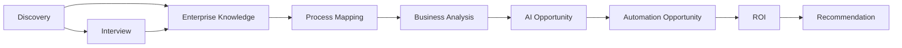
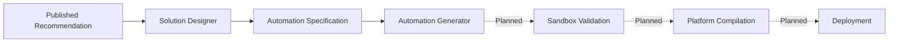

# AutomateX — Project State

Last verified: 2026-07-28.

This file is the canonical implementation-status matrix. Status is based on repository evidence,
not roadmap intent.

## Platform capabilities

| Capability                                  | State       | Evidence                                                   |
| ------------------------------------------- | ----------- | ---------------------------------------------------------- |
| Authentication and atomic onboarding        | Implemented | onboarding module, foundation migration and tests          |
| Multi-tenancy, PostgreSQL RLS and Prisma    | Implemented | migrations, Prisma schema, pgTAP and authenticated DB flow |
| CI quality and database-security jobs       | Implemented | `.github/workflows`                                        |
| Audit questionnaires and audit sessions     | Implemented | questionnaire/audit modules and API routes                 |
| Executive Report v1                         | Implemented | report module, dashboard, charts and report API            |
| V1 Enterprise Intelligence chain            | Implemented | Discovery through Recommendation Portfolio                 |
| Solution Designer                           | Implemented | domain, application, infrastructure, API and persistence   |
| Automation Specification                    | Implemented | bounded context, API, migration and tests                  |
| Automation Generator Domain                 | Implemented | aggregate, graph model, provenance, catalogs and tests     |
| Automation Generator Application            | Implemented | commands, queries, ports, transactions and tests           |
| Automation Generator Infrastructure         | Implemented | Prisma adapters, outbox, idempotency and RLS migration     |
| Automation Generator Composition Root       | Implemented | providers, factories and architecture tests                |
| Automation Generator real graph compiler    | Planned     | placeholder intentionally throws NotImplemented            |
| Automation Generator REST interface         | Planned     | no controller, route or HTTP DTO exists                    |
| Sandbox Validation and platform compilation | Planned     | no bounded context implementation                          |
| Deployment, Monitoring and Optimization     | Planned     | no bounded context implementation                          |
| Enterprise Simulator                        | Planned     | not implemented in this repository                         |

Automation Generator as a product capability is therefore **In Progress**.

## Canonical V1 chain

All contexts in this chain are Implemented. Historical Rules, ROI and Recommendations modules also
remain Implemented for backward compatibility; they are not the canonical V1 chain.

## V2 chain

Solution Designer and Automation Specification are Implemented. Automation Generator is In
Progress as detailed above. Everything downstream is Planned.

## Known documentation divergence

Before this documentation foundation, `ROADMAP.md`, `ARCHITECTURE.md` and the old project state
contained pre-implementation language for V2 and stale V1 status labels. This file supersedes those
status statements. Consolidating duplicated long-form architecture text is Planned; frozen
architecture contracts remain unchanged.
