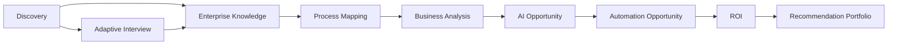
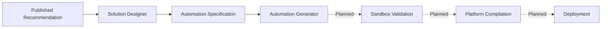

# AutomateX — Project Status and Drift Report

Status: **Implemented**

Audit date: 2026-07-28  
Audited branch: `docs/enterprise-foundation`  
Audited SHA: `ec674ec8e6ccb9b9290cafb7d2baa2f130a6844f`  
Official `origin/main`: `c99f6d4c4f3dcd97b6f63eeacae77d77625799c0`

## 1. Executive conclusion

### Have we drifted?

**Not from the product vision or core business architecture. Yes, materially from release and Git
governance.**

AutomateX still follows its defining principles:

- deterministic business decisions;
- no LLM in decision-making;
- explainable outputs and provenance;
- versioned, immutable published snapshots;
- independent bounded contexts;
- Supabase PostgreSQL, Prisma and RLS;
- tenant isolation;
- explicit lifecycle and optimistic locking;
- tests and documentation as product artifacts.

The project has not become a different product. The implemented chain remains consistent with the
Enterprise Intelligence Platform vision.

The critical drift is elsewhere: there is no single official source branch containing the whole
platform. The audited branch is 14 commits ahead of `origin/main` and 7 commits behind it. It
contains Automation Specification, Automation Generator layers and the enterprise documentation,
while `main` contains later direct documentation changes. Consequently, neither SHA alone is a
complete baseline.

### Overall state

| Dimension                        | Assessment                                 |
| -------------------------------- | ------------------------------------------ |
| Product direction                | **Aligned**                                |
| Business architecture            | **Aligned**                                |
| DDD/Clean Architecture direction | **Aligned with legacy inconsistencies**    |
| Security architecture            | **Aligned, remediation pending**           |
| Test and build health            | **Healthy**                                |
| Operational maturity             | **Incomplete**                             |
| Documentation                    | **Substantial but split across histories** |
| Git/release governance           | **Critically drifted**                     |
| Baseline readiness               | **NO GO**                                  |

AutomateX is an engineered platform with strong Enterprise foundations. It is not yet an approved
Release Candidate and must not receive the baseline tag today.

## 2. Where the project is today

### Verified repository scale

| Asset                              |      Current quantity |
| ---------------------------------- | --------------------: |
| Bounded-context/module directories |                    20 |
| Next.js route handlers             |                    89 |
| Next.js pages                      |                    27 |
| Prisma models                      |                   114 |
| Prisma enums                       |                    46 |
| Supabase migrations                |                    19 |
| pgTAP database test files          |                    17 |
| Vitest files                       |                    71 |
| Passing Vitest tests               |                   320 |
| Markdown documents                 | 79 before this report |
| ADRs                               |         20 plus index |

### Platform foundation

Implemented:

- authentication and atomic onboarding;
- organizations, memberships and roles;
- multi-tenancy;
- PostgreSQL RLS;
- Prisma server-side data access;
- migrations and timestamp/lifecycle constraints;
- lint, format, typecheck, test, build and database CI jobs.

Assessment: **stable and structurally aligned**.

### V1 Enterprise Intelligence chain

All contexts in this canonical chain are Implemented. Discovery and Interview feed Enterprise
Knowledge; downstream engines consume canonical snapshots rather than duplicating company
profiles or reading raw answers directly.

Assessment: **functionally complete for V1 and aligned with the documented engine chain**.

### Reporting and user-facing capabilities

Implemented:

- audit questionnaire and sessions;
- Companies;
- executive report v1;
- KPI cards and deterministic executive summary;
- charts and report JSON;
- user interfaces for the principal V1 workflows.

Assessment: **implemented, but not yet supported by full browser E2E, accessibility-regression or
performance suites**.

### V2 chain

| Capability                            | Code state on audited branch | State on `origin/main` |
| ------------------------------------- | ---------------------------- | ---------------------- |
| Solution Designer                     | Implemented                  | Implemented            |
| Automation Specification              | Implemented                  | Not integrated         |
| Automation Generator Domain           | Implemented                  | Not integrated         |
| Automation Generator Application      | Implemented                  | Not integrated         |
| Automation Generator Infrastructure   | Implemented                  | Not integrated         |
| Automation Generator Composition Root | Implemented                  | Not integrated         |
| Real deterministic graph compiler     | Planned; placeholder only    | Not present            |
| Generator REST interface              | Planned                      | Not present            |
| Sandbox Validation                    | Planned                      | Not present            |
| Platform-specific compilation         | Planned                      | Not present            |
| Deployment/Monitoring/Optimization    | Planned                      | Not present            |

Automation Generator is therefore **In Progress**, not complete. Its architecture and supporting
layers exist, but it does not yet generate a real workflow and exposes no REST controller.

### Enterprise Simulator

The Enterprise Simulator is **Planned** as a separate internal tool. PR #21 is still draft and
contains architecture/contracts/roadmap work. It is not part of the AutomateX runtime and must stay
outside baseline reconciliation.

## 3. Health evidence

### Local and CI quality

The last complete local run on the cumulative platform branch passed:

- clean npm installation;
- Prisma generation;
- ESLint with zero warnings;
- Prettier check;
- TypeScript strict typecheck;
- 71 Vitest files and 320 tests;
- Next.js production build.

At the audited SHA, GitHub Actions reports:

- `quality`: **success**;
- `database-security`: **success**.

This is strong evidence that the current branch is internally coherent.

### Database and tenant security

Implemented:

- 19 ordered migrations;
- 17 pgTAP suites;
- RLS across tenant-owned tables;
- organization-aware permissions;
- composite tenant references in mature contexts;
- PostgreSQL lifecycle/immutability protections;
- application and database transaction boundaries;
- independent database-security CI.

Local Docker was unavailable during release-readiness verification, but the exact branch SHA passed
the Linux `database-security` job. Local reproducibility remains a release condition.

### Dependency security

Current audit:

| Severity | Packages |
| -------- | -------: |
| Critical |        0 |
| High     |        9 |
| Medium   |        4 |
| Low      |        0 |

The 13 packages belong primarily to two development-tooling chains:

- ESLint/minimatch/brace-expansion;
- Prisma/@prisma/dev/Hono/Valibot.

Nine paths are classified Must Fix Before Baseline. No package has yet been changed, which is
correct under the development freeze. The remediation and rollback sequence is documented.

### Test limitations

The suite is substantial, but the following evidence is missing:

- measured code coverage and approved thresholds;
- repository-wide automated dependency graph;
- full browser E2E journeys;
- automated accessibility regression;
- load/performance baselines;
- mutation tests for critical deterministic formulas;
- production observability tests.

Therefore “320 tests pass” must not be interpreted as complete behavioral coverage.

## 4. Alignment with the product vision

### Aligned areas

| Product principle                 | Evidence                                                                         | Verdict                                         |
| --------------------------------- | -------------------------------------------------------------------------------- | ----------------------------------------------- |
| Determinism over opaque decisions | Rule, analysis, opportunity, ROI, recommendation and design engines are explicit | Aligned                                         |
| LLM does not decide               | No decision engine delegates business choices to GPT                             | Aligned                                         |
| Explainability                    | Evidence, provenance, catalog versions and source snapshots are persisted        | Aligned                                         |
| Canonical company knowledge       | Discovery/Interview project into Enterprise Knowledge                            | Aligned                                         |
| Independent engines               | Bounded contexts consume published/ready upstream contracts                      | Aligned                                         |
| Immutable publication             | Published versions are protected in domain and PostgreSQL in mature contexts     | Aligned                                         |
| Multi-tenancy                     | Application authorization, tenant identifiers, RLS and pgTAP                     | Aligned                                         |
| Configurable catalogs             | Published/versioned catalogs configure decisions without replacing algorithms    | Aligned                                         |
| Human publication control         | Lifecycle permissions govern validation/publication                              | Aligned                                         |
| Documentation as product          | 79+ documents, ADRs and frozen contracts                                         | Aligned in content; governance conflict remains |

### No evidence of product-scope drift

The repository does not contain:

- an AI system making business decisions;
- generated provider-specific workflows presented as complete;
- an unauthorized deployment engine;
- a hidden full Simulator implementation;
- a currency conversion engine contrary to the MVP decision;
- direct downstream reads of Discovery/Interview where Enterprise Knowledge is required;
- a replacement of deterministic rules with LLM output.

The team has added breadth rapidly, but the breadth follows the approved sequence of business
engines rather than an unrelated product direction.

## 5. Architectural drift

### DDD drift: limited and historical

The latest contexts are strongly aligned with DDD:

- explicit aggregates and Value Objects;
- lifecycle invariants;
- domain services;
- immutable snapshots;
- provenance;
- deterministic IDs and hashing;
- application ports and adapters.

Older contexts often use thinner domain models or large domain services. This is architectural
debt, not a change of direction.

Verdict: **minor-to-moderate implementation drift, no bounded-context boundary collapse**.

### Clean Architecture drift: real but contained

Automation Generator demonstrates the desired dependency direction. Several older Application
services still import concrete Prisma repository types, and many Presentation adapters construct
repositories directly.

Impact:

- Dependency Inversion is inconsistent;
- older use cases are harder to isolate;
- composition responsibility is dispersed;
- replacement of Infrastructure is more expensive.

No emergency refactor is justified before the baseline. The debt should be addressed incrementally
after release, context by context, with no business behavior change.

Verdict: **moderate legacy drift from the target architecture**.

### Data-boundary drift

Some Infrastructure repositories use TypeScript casts for persisted JSON instead of uniform
runtime validation before domain construction. Later contexts are better protected.

Impact: malformed or legacy JSON may be trusted too early.

Verdict: **high-priority technical debt, not confirmed data corruption**.

### Composition drift

Explicit composition exists for Automation Generator, while older contexts often use manual
construction in Presentation. This is inconsistent but operational.

Verdict: **moderate standardization debt**.

## 6. Governance and baseline drift

This is the project's most serious problem.

### Divergent histories

The audited branch:

- is 14 commits ahead of `origin/main`;
- is 7 commits behind `origin/main`;
- contains the V2 Automation Specification/Generator stack and enterprise documentation;
- conflicts with `main` in `AUTOMATEX_CODEX.md`;
- conflicts structurally because `main` has a `docs/product` file while this branch has a
  `docs/product/` directory.

`main` is therefore not the complete platform, and the feature/documentation branch is not the
official release line.

### Stacked branch model

Automation Specification and Generator branches form one linear dependency stack. Treating each
as an independent merge candidate would duplicate review and increase conflict risk.

### Direct documentation changes on main

Seven direct documentation commits were added after the last shared merge. Even when content is
valid, direct edits weaken traceability and created the current structural conflict.

### Stale branches

Companies, Discovery, Process Mapping, Solution Designer and revert branches remain published
despite their functional content already being represented in `main` by ancestry or patch
equivalence.

Verdict: **critical release-governance drift**.

## 7. Documentation drift

### Positive

- canonical project state exists;
- roadmap distinguishes Implemented, In Progress and Planned;
- Product Constitution is explicit;
- ADRs 0013–0020 document cross-cutting architecture;
- release readiness, remediation and baseline plans exist;
- relative-link scan previously found zero broken links.

### Remaining divergence

- `main` and the audited branch contain competing documentation histories;
- product documents exist at root on `main` and under the canonical `docs/product/` directory on
  the audited branch;
- `AUTOMATEX_CODEX.md` has a semantic merge conflict;
- older architecture documents contain duplicated long-form explanations;
- ADRs 0001–0012 need formatting normalization;
- no single generated API reference/OpenAPI contract exists.

Verdict: **content substantially aligned, source-of-truth location not yet aligned**.

## 8. Operational maturity

AutomateX is not yet an operationally complete Enterprise platform.

Missing or incomplete:

- production deployment topology;
- environment promotion strategy;
- centralized metrics, traces and error aggregation;
- service-level objectives;
- alerting and incident response;
- tested backup/restore and disaster recovery runbooks;
- rate limiting and abuse protection;
- secrets rotation runbook;
- performance budgets and load tests;
- complete API governance;
- release signing and provenance process.

These gaps do not invalidate V1 business functionality. They limit production readiness and the
ability to operate the platform reliably at Enterprise scale.

Verdict: **engineering maturity 3/5; operations maturity 2/5**.

## 9. Drift matrix

| Drift category                           | Severity | Has drift occurred?                 | Required response                                         |
| ---------------------------------------- | -------- | ----------------------------------- | --------------------------------------------------------- |
| Product mission                          | Low      | No                                  | Preserve current constitution                             |
| Business rules and deterministic engines | Low      | No material drift detected          | Continue architecture reviews                             |
| Bounded-context boundaries               | Medium   | Limited legacy inconsistency        | Incremental post-baseline cleanup                         |
| Clean Architecture                       | Medium   | Yes in older contexts               | Introduce ports/composition context by context            |
| Runtime JSON validation                  | High     | Yes, inconsistent                   | Validate at Infrastructure boundaries                     |
| Test strategy                            | High     | Yes relative to Enterprise ambition | Add coverage, E2E, accessibility and performance evidence |
| Security dependencies                    | High     | Known unresolved findings           | Execute approved Prisma/ESLint remediation                |
| Documentation content                    | Medium   | Mostly aligned                      | Reconcile duplicates and canonical locations              |
| Git baseline                             | Critical | Yes                                 | Create one integration SHA without rewriting history      |
| Release governance                       | Critical | Yes                                 | PR-only integration, exact-SHA validation, signed tag     |
| Operations/observability                 | High     | Behind product ambition             | Plan after baseline; do not disguise as Implemented       |

## 10. What must happen next

### Phase 1 — Recover one source of truth

1. Keep the development freeze.
2. Create `baseline/automatex-platform-v1` from current `origin/main`.
3. Merge `docs/enterprise-foundation` without squash.
4. Resolve only documentation conflicts.
5. Preserve frozen architecture commit ancestry.
6. Validate the reconciled SHA locally and in CI.

### Phase 2 — Remediate dependency tooling

1. Upgrade the Prisma family in one isolated security PR.
2. Run application, migration, RLS and pgTAP regression.
3. Upgrade ESLint core in a second isolated PR.
4. Keep all lint rules enabled.
5. Document any upstream Next.js plugin exception with owner and expiry.

### Phase 3 — Produce the Release Candidate

1. Run clean install and full quality matrix.
2. Run all migrations from an empty local Supabase database.
3. Run all pgTAP suites.
4. Generate code coverage and approve thresholds.
5. Synchronize project state, ADR index, roadmap, changelog and release notes.
6. Record rollback evidence.
7. Create a signed annotated baseline tag only after independent approval.

### Phase 4 — Post-baseline improvements

In priority order:

1. operational runbooks and observability;
2. repository-wide dependency-rule enforcement;
3. uniform JSON runtime validation;
4. E2E/accessibility/performance testing;
5. incremental port/composition cleanup of older contexts;
6. API contract/versioning documentation;
7. only then resume Automation Generator compiler work under its frozen architecture.

## 11. What must not happen

- Do not start another bounded context.
- Do not merge stale or revert branches.
- Do not squash the frozen architecture stack.
- Do not force dependency overrides to hide audit findings.
- Do not downgrade `eslint-config-next`.
- Do not disable lint/tests.
- Do not call Automation Generator complete.
- Do not tag either current branch as the baseline.
- Do not refactor all legacy contexts before release.
- Do not merge the Simulator into the runtime baseline.

## 12. Final assessment

### Product verdict

**AutomateX is still the product that was designed.**

The deterministic Enterprise Intelligence vision has been preserved. The canonical engine chain,
multi-tenant security, versioning, explainability and separation from LLM decision-making remain
intact.

### Architecture verdict

**The direction is correct, but generations of code are not equally mature.**

Recent contexts meet a stronger Clean Architecture standard than older ones. This is manageable
technical debt, not architectural failure.

### Release verdict

**NO GO for `automatex-platform-v1.0.0-baseline` today.**

The project has drifted in branch governance and release discipline. Until `main` and the
cumulative platform stack are reconciled into one fully validated SHA, there is no honest baseline
to tag.

### Plain-language answer

We have not lost the product vision. We have built the right engines in the right general order.
The problem is that development advanced faster than integration and release governance.

The correct next move is not more development. It is to consolidate the Git history, remediate the
tooling vulnerabilities, rerun every quality/database control on one SHA, and sign that SHA as the
first official baseline.
