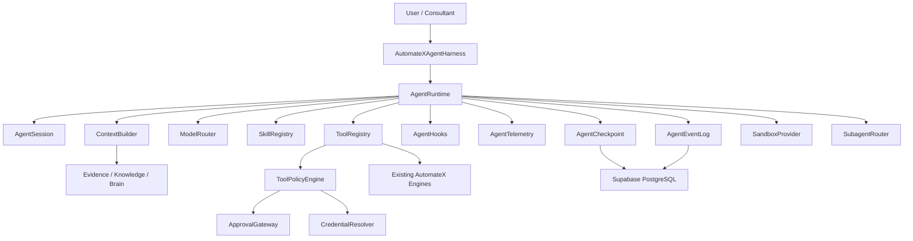
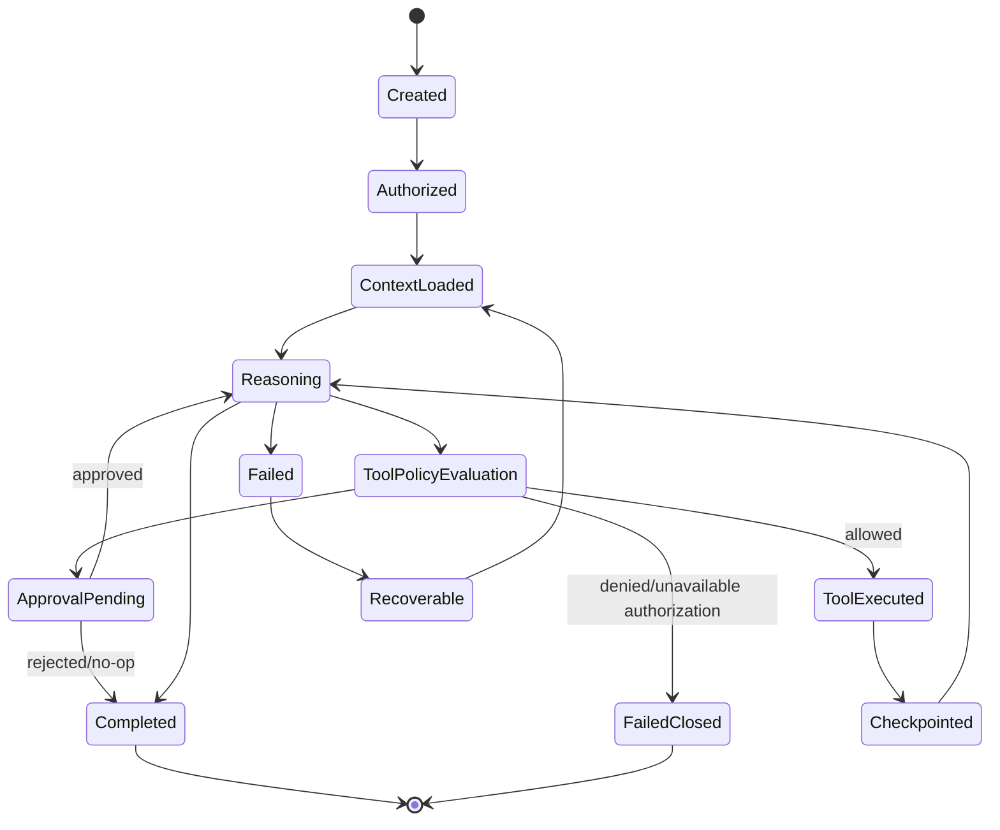

# AutomateX Agentic Architecture

Status: Future architecture blueprint — documentation only
Scope: Agentic architecture target for post-P0 work
Implementation status: Not implemented

## 1. Purpose

AutomateX will eventually use agents to help consultants and customers navigate audits, evidence,
business reasoning, recommendations, solution design and operational follow-up. Agents are an
orchestration and reasoning layer; they are not a new source of truth and they do not replace the
existing production engines.

This blueprint is consistent with the current AutomateX core:

- Evidence is authoritative.
- Brain owns structured business context and reasoning artifacts.
- Rule/business engines own deterministic decisions.
- Supabase/PostgreSQL remains authoritative persistence.
- Agents may reason, explain, ask, draft and orchestrate within policy.
- Agents must not silently mutate facts, business decisions or customer systems.

DeepSeek Harness and Cordis may be studied as architectural references for harness design,
checkpointing, eventing and agent composition. AutomateX must not depend on either project.

## 2. Non-negotiable invariants

1. Evidence is authoritative.
2. Brain owns structured business context.
3. Rule and business engines own deterministic decisions.
4. Agents reason and orchestrate but do not become sources of truth.
5. User validation is required for consequential decisions.
6. External actions require policy evaluation.
7. Sensitive actions require human approval.
8. Authorization failure fails closed.
9. Supabase/PostgreSQL remains authoritative persistence.
10. Client data remains tenant isolated.
11. Models remain provider-independent.
12. Credentials are never model-visible.
13. Every agent action is auditable.
14. Agent runs are replayable and recoverable.
15. Existing AutomateX engines are reused, not duplicated.

## 3. Relationship with existing AutomateX core

| Existing component       | Owns today                                                            | Agent relationship                                                 | Agent must not do                                                           |
| ------------------------ | --------------------------------------------------------------------- | ------------------------------------------------------------------ | --------------------------------------------------------------------------- |
| Evidence                 | Observed or supplied source information                               | Retrieve, select, cite, summarize                                  | Invent evidence or modify immutable evidence                                |
| Brain                    | Evidence, Claims, Unknowns, Contradictions, ReasoningTrace, Decisions | Build compact context, ask for reasoning assistance, explain trace | Override Brain confidence, contradiction materiality or decision guards     |
| Work Intelligence        | Work activity observations and process intelligence                   | Request summaries, identify gaps, draft observation questions      | Rank employees or create direct solution designs                            |
| Rule Engine              | Deterministic rules and eligibility                                   | Invoke and explain outputs                                         | Reimplement rule logic in prompts                                           |
| Business Analysis        | Current-state findings                                                | Consume published findings                                         | Read raw interview/discovery data directly when a published artifact exists |
| AI Opportunities         | Opportunity candidates grounded in analysis                           | Explain and compare candidates                                     | Promote unsupported opportunities                                           |
| Automation Opportunities | Qualified opportunities and deterministic decisions                   | Draft review narratives and follow-up questions                    | Recommend without deterministic qualification                               |
| ROI                      | Assumptions, ROI math and economic decisions                          | Explain assumptions and identify missing evidence                  | Invent ROI inputs or hide uncertainty                                       |
| Recommendations          | Portfolio fit, business recommendation decisions                      | Draft executive explanation and action plan                        | Duplicate recommendation semantics                                          |
| Solution Designer        | Future-state solution blueprint                                       | Draft solution options from approved recommendations               | Publish blueprint directly or bypass readiness checks                       |
| Automation Specification | Technical automation specification                                    | Draft specification sections from approved blueprint               | Write executable workflow contracts directly from agent output              |
| Automation Generator     | Compilation/generation from approved specification                    | Monitor, explain, request approval                                 | Generate or deploy without policy and approval                              |

## 4. Target agentic system overview

## 5. Future subsystems

### AutomateXAgentHarness

Top-level application boundary for agent execution. It authenticates the caller, creates an
`AgentSession`, resolves tenant/company/audit scope, starts an `AgentRun`, and wires runtime
dependencies. It never embeds provider-specific model logic and never bypasses application
authorization.

### AgentRuntime

Executes one agent run through deterministic stages:

1. authorize;
2. load compact context;
3. select skills;
4. route model call if needed;
5. request tool execution;
6. evaluate tool policy;
7. request approval when required;
8. persist event/checkpoint;
9. record outcome.

The runtime owns orchestration safety, not business truth.

### AgentSession

Tenant-scoped conversation/execution envelope. It stores user, tenant, company, audit, agent type,
purpose, policy version and status. A session may contain multiple runs.

### AgentEventLog

Append-only log for every material agent action. It supports audit, replay, failure forensics and
post-incident review. Events must be tenant-scoped and ordered.

### AgentCheckpoint

Recoverable snapshot of an agent run: current step, selected context references, tool state,
pending approval, redaction policy, model invocation references and deterministic runtime metadata.
The checkpoint stores references and safe summaries, not raw secrets.

### ContextBuilder

Builds compact, task-specific context from authoritative AutomateX data. It retrieves Brain and
Evidence selectively, filters by confidence, redacts sensitive content and enforces token budgets.

### ModelRouter

Provider-neutral router that selects model/provider by task, privacy, cost, quality, latency,
context size, structured-output needs and availability. It exposes no provider assumptions to
Domain or deterministic engines.

### SkillRegistry

Versioned catalogue of composable skills. Skills describe methodology, prompts, policies, examples
and constraints. They are loaded by explicit version; there is no fallback to latest for published
runs.

### ToolRegistry

Catalogue of callable capabilities. Each tool declares input/output contract, risk level, required
authorization, idempotency, external-action behavior, credential requirements and audit event
schema.

### ToolPolicyEngine

Evaluates whether a tool request is allowed, denied, needs approval or needs additional context.
It is the mandatory gate before mutation or external side effects.

### ApprovalGateway

Human approval boundary for consequential actions. It records approval requests, decisions,
actor, timestamp, scope, policy version and exact proposed action.

### CredentialResolver

Resolves credentials only at execution time for approved tools. Credentials are never included in
model context, checkpoints, events, traces or prompts.

### AgentHooks

Lifecycle extension points: before context load, after context load, before model call, after model
call, before tool policy, after tool result, before checkpoint, after outcome. Hooks must be
deterministic where they affect persisted state.

### AgentTelemetry

Operational metrics for quality, latency, cost, model calls, tool usage, approvals, denials,
fallbacks and failures. Telemetry must not contain secrets or customer-sensitive free text unless
explicitly approved and redacted.

### SandboxProvider

Executes untrusted analysis, generated code or connector dry-runs in isolated environments. Runtime
Core, Brain and Domain remain independent from sandbox implementations.

### SubagentRouter

Future coordinator for bounded multi-agent delegation. It can route a subtask to a specialized
agent only when tenant scope, context and approval boundaries are explicit. It must prevent
cross-agent context leakage.

## 6. Specialized agents

| Agent                  | Responsibility                                    | Allowed inputs                                                     | Authoritative sources                                             | Allowed tools                                                      | Forbidden actions                                                                               | Outputs                                             | Approval requirements                                        | Risk  |
| ---------------------- | ------------------------------------------------- | ------------------------------------------------------------------ | ----------------------------------------------------------------- | ------------------------------------------------------------------ | ----------------------------------------------------------------------------------------------- | --------------------------------------------------- | ------------------------------------------------------------ | ----- |
| AuditAgent             | Guide audit progress and evidence acquisition     | tenant, company, audit, gaps, Brain summary                        | Evidence, Brain, Discovery, Interview, Knowledge snapshots        | read, analyze, draft questions, request approved discovery actions | Direct FACT creation, direct projection, external mutation                                      | audit guidance, evidence requests, gap explanations | Required for new production discovery actions                | R2/R3 |
| ConsultantAgent        | Help consultant explain findings and next steps   | published artifacts, executive decisions, approved recommendations | Brain trace, ROI, Recommendations, Executive Result               | read, analyze, draft narrative, prepare approval requests          | Change deterministic decisions or ROI                                                           | customer-facing explanation drafts                  | Required before sending consequential customer communication | R2    |
| KnowledgeAgent         | Curate and reconcile enterprise knowledge         | evidence, candidates, contradictions, source metadata              | Enterprise Knowledge, Evidence, Brain                             | read, analyze, draft projection plans                              | Auto-accept candidates, resolve contradiction by itself                                         | projection review draft, source map                 | Required for Knowledge mutations                             | R3    |
| WorkflowArchitectAgent | Draft future workflow/automation design           | approved recommendations, blueprint readiness, constraints         | Recommendations, Solution Designer, Automation Specification      | read, analyze, draft blueprint/spec sections                       | Compile/deploy workflow, bypass approval                                                        | solution alternatives, implementation notes         | Required before publish/spec generation                      | R2/R3 |
| DeploymentAgent        | Prepare deployment plans for approved automations | published specifications, runtime policy, connector capabilities   | Automation Specification, Automation Generator, Runtime contracts | read, analyze, dry-run, draft deployment checklist                 | Live external action without policy/approval                                                    | deployment plan, risk checklist                     | Required for any live connector/action                       | R4    |
| MonitoringAgent        | Observe outcomes and anomalies                    | runtime events, outcome records, monitoring data                   | Runtime, Event Store, Outcomes, Evidence                          | read, analyze, alert draft                                         | Mutate production or tune engines automatically                                                 | monitoring insight, incident summary                | Required for operational action                              | R1/R2 |
| OptimizationAgent      | Suggest improvements from outcomes                | outcome evidence, ROI actuals, process changes                     | Outcomes, Evidence, ROI, Recommendations                          | read, analyze, draft improvement candidate                         | Self-modify rules/prompts/knowledge                                                             | optimization candidate                              | Required for recommendation changes                          | R2/R3 |
| OlympusAgent           | Executive-level orchestration and portfolio view  | approved summaries from all domains                                | Published Executive Result, Brain traces, portfolio decisions     | read, analyze, coordinate subagents, draft executive summary       | Bypass subagent policy, approve itself, perform tools directly when delegated agent is required | executive synthesis, orchestration plan             | Human approval for consequential portfolio decisions         | R2/R4 |

## 7. Agent run lifecycle

## 8. Future persistence concepts

These names are reserved for future design only. No table is created by this blueprint.

| Concept                   | Purpose                                                                     |
| ------------------------- | --------------------------------------------------------------------------- |
| `agent_sessions`          | tenant/user/company/audit scoped session envelope                           |
| `agent_runs`              | individual execution attempt with status, policy and model routing metadata |
| `agent_events`            | append-only audit log                                                       |
| `agent_checkpoints`       | recoverable run snapshots                                                   |
| `agent_context_snapshots` | redacted context references and token budget record                         |
| `tool_invocations`        | tool request, policy decision and safe result metadata                      |
| `approval_requests`       | proposed consequential action requiring human decision                      |
| `approval_decisions`      | granted/rejected/expired approval record                                    |
| `skills`                  | logical skill package registry                                              |
| `skill_versions`          | immutable skill versions and compatibility metadata                         |
| `model_invocations`       | provider-neutral model call metadata and safe usage/cost data               |
| `agent_outcomes`          | final run result and downstream impact references                           |

## 9. Provider independence

Agents depend on the `ModelRouter`, not direct provider SDKs. Providers may include OpenAI,
Anthropic, Google, DeepSeek, Mistral and local models. Provider-specific request normalization
belongs in infrastructure/adapters and never in Brain or business engines.

## 10. Current conflicts and open questions

No direct conflict with current AutomateX architecture was found. The main future design risks are:

- agent persistence tables do not yet exist;
- approval policy needs exact product UX and authorization roles before implementation;
- model invocation retention and redaction policies must be aligned with tenant privacy contracts;
- skill version compatibility rules need a future migration strategy;
- subagent orchestration must not start before single-agent auditability and recovery are proven.

## 11. Implementation boundary

This document freezes architecture direction only. It does not implement agents, tools, skills,
persistence, migrations, connectors, model calls, UI, Runtime changes or production behavior.
