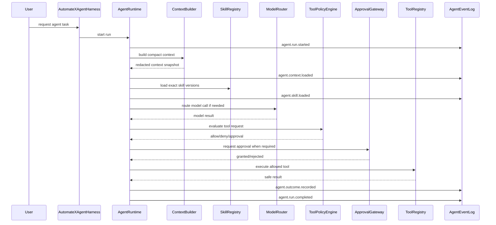

# AutomateX Agent Runtime Contract

Status: Future runtime contract — documentation only
Implementation status: Not implemented

## 1. Contract purpose

`AgentRuntime` is the future execution boundary for AutomateX agents. It coordinates context,
skills, models, tools, policy, approval, checkpoints and audit logs. It does not own deterministic
business decisions and does not replace Runtime Core, Brain, Rule Engine, ROI, Recommendations or
Solution Designer.

## 2. Core runtime entities

### AgentSession

Persistent tenant-scoped envelope for one user-facing agent experience.

Required fields in a future implementation:

- `sessionId`;
- `tenantId`;
- `companyId` when scoped;
- `auditId` when scoped;
- `actorId`;
- `agentType`;
- `purpose`;
- `policyVersion`;
- `createdAt`;
- `status`.

### AgentRun

One execution attempt inside a session.

Required fields:

- `runId`;
- `sessionId`;
- `tenantId`;
- `agentType`;
- `input`;
- `runtimeVersion`;
- `modelRoutingPolicyVersion`;
- `skillVersionRefs`;
- `status`;
- `startedAt`;
- `completedAt`;
- `failureReason`.

### AgentCheckpoint

Recoverable snapshot of run progress.

Required fields:

- `checkpointId`;
- `runId`;
- `tenantId`;
- `sequence`;
- `currentStep`;
- `contextSnapshotId`;
- `pendingToolInvocationId`;
- `pendingApprovalRequestId`;
- `safeRuntimeState`;
- `checksum`;
- `createdAt`.

### AgentEvent

Append-only audit event.

Required fields:

- `eventId`;
- `tenantId`;
- `sessionId`;
- `runId`;
- `eventType`;
- `sequence`;
- `occurredAt`;
- `actorId`;
- `agentType`;
- `safePayload`;
- `correlationId`.

## 3. Lifecycle



## 4. State model

| State                 | Meaning                                       | Allowed next states                                             |
| --------------------- | --------------------------------------------- | --------------------------------------------------------------- |
| `CREATED`             | Run accepted but not authorized               | `AUTHORIZED`, `FAILED_CLOSED`                                   |
| `AUTHORIZED`          | Actor and tenant scope validated              | `CONTEXT_LOADING`, `FAILED_CLOSED`                              |
| `CONTEXT_LOADING`     | ContextBuilder is selecting/redacting context | `CONTEXT_READY`, `FAILED`                                       |
| `CONTEXT_READY`       | Compact context snapshot exists               | `REASONING`, `COMPLETED`                                        |
| `REASONING`           | Model or deterministic agent step is running  | `TOOL_POLICY_PENDING`, `CHECKPOINTING`, `FAILED`                |
| `TOOL_POLICY_PENDING` | Tool request awaiting policy decision         | `APPROVAL_PENDING`, `TOOL_EXECUTING`, `DENIED`, `FAILED_CLOSED` |
| `APPROVAL_PENDING`    | Human approval required                       | `TOOL_EXECUTING`, `DENIED`, `EXPIRED`                           |
| `TOOL_EXECUTING`      | Registered tool is executing                  | `CHECKPOINTING`, `FAILED`                                       |
| `CHECKPOINTING`       | Safe state is being persisted                 | `REASONING`, `COMPLETED`, `RECOVERABLE_FAILED`                  |
| `COMPLETED`           | Run finished successfully                     | terminal                                                        |
| `DENIED`              | Requested action denied safely                | terminal or `REASONING` for alternatives                        |
| `FAILED`              | Runtime failure                               | `RECOVERABLE_FAILED`, terminal                                  |
| `FAILED_CLOSED`       | Security/authorization failure                | terminal                                                        |
| `RECOVERABLE_FAILED`  | Checkpoint exists and can resume              | `CONTEXT_LOADING`, terminal                                     |
| `EXPIRED`             | Approval/session expired                      | terminal                                                        |

## 5. Event model

| Event                           | Required safe payload                                |
| ------------------------------- | ---------------------------------------------------- |
| `agent.run.started`             | session/run/tenant/agent/policy refs                 |
| `agent.context.loaded`          | context snapshot id, source counts, redaction policy |
| `agent.skill.loaded`            | skill ids and exact versions                         |
| `agent.tool.requested`          | tool id/version, risk level, target refs             |
| `agent.tool.denied`             | policy reason code, risk level                       |
| `agent.approval.requested`      | approval id, action summary, expiry                  |
| `agent.approval.granted`        | approval id, approver id, scope                      |
| `agent.approval.rejected`       | approval id, approver id, reason code                |
| `agent.tool.executed`           | invocation id, status, safe output refs              |
| `agent.checkpoint.created`      | checkpoint id, sequence, checksum                    |
| `agent.recommendation.proposed` | recommendation draft refs, trace refs                |
| `agent.outcome.recorded`        | outcome id, result type, downstream refs             |
| `agent.run.completed`           | duration, outcome refs, cost summary                 |
| `agent.run.failed`              | safe error class, stage, retry/recovery eligibility  |

## 6. ContextBuilder contract

The context pipeline is:

```text
Task
→ context requirement
→ Brain retrieval
→ evidence selection
→ confidence filtering
→ contradiction/unknown inclusion
→ redaction
→ token budgeting
→ compact agent context
```

ContextBuilder must:

- select only relevant tenant/company/audit data;
- preserve evidence IDs and provenance;
- preserve uncertainty and contradiction markers;
- redact secrets and unnecessary personal data;
- include confidence and policy versions;
- produce deterministic context metadata for replay.

It must not:

- send the full Brain blindly;
- include cross-tenant data;
- include hidden GroundTruth;
- convert claims into facts;
- strip uncertainty language from evidence.

## 7. ModelRouter contract

Routing dimensions:

- task type;
- quality requirement;
- cost budget;
- latency budget;
- privacy tier;
- context length;
- structured-output requirement;
- provider availability;
- tenant/provider policy.

Supported provider families may include OpenAI, Anthropic, Google, DeepSeek, Mistral and local
models. The router returns an exact provider/model/version/config. Published runs must record exact
routing metadata and must not use fallback latest.

## 8. Tool invocation contract

Every tool declares:

- `toolId`;
- `toolVersion`;
- input schema;
- output schema;
- risk level R0-R5;
- idempotency behavior;
- required permission;
- required approval behavior;
- credential references;
- safe persistence rules;
- event schema.

Tool execution flow:

```text
agent requests tool
→ ToolRegistry resolves exact tool version
→ ToolPolicyEngine evaluates risk and authorization
→ ApprovalGateway if required
→ CredentialResolver if required
→ tool executes
→ safe result persisted
→ event emitted
```

## 9. Recovery and replay

Agent runs must be recoverable from:

- event log;
- latest valid checkpoint;
- context snapshot references;
- exact skill versions;
- exact model routing metadata;
- safe tool invocation records.

Replay is for audit and debugging. Replay must not re-execute external side effects unless an
explicit future replay policy marks them as dry-run/simulated.

## 10. Runtime non-goals

This contract does not implement agents, model calls, tools, approval UI, tables, migrations,
connectors, sandboxing, Runtime Core changes or business engine changes.
