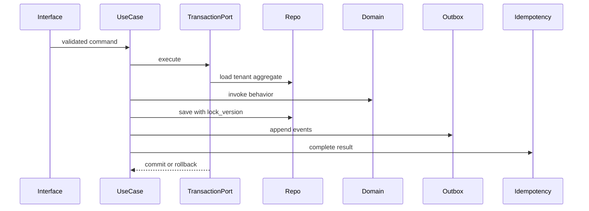

# AutomateX System Architecture

Status: **Current architecture summary**

Last verified: 2026-08-23

## Platform

AutomateX is a Next.js and TypeScript application backed by Supabase PostgreSQL/Auth/RLS. Prisma is
the server-side data access layer. Vitest covers TypeScript behavior and pgTAP covers PostgreSQL
contracts and tenant isolation.

## Logical layers

| Layer          | Owns                                                   | Must not own                          |
| -------------- | ------------------------------------------------------ | ------------------------------------- |
| Domain         | aggregates, Value Objects, invariants, Domain Services | Prisma, HTTP, UI, cross-context logic |
| Application    | use cases, commands, queries, ports, transactions      | business rules, SQL, HTTP DTOs        |
| Infrastructure | Prisma repositories, clocks, outbox, external adapters | business decisions                    |
| Interfaces     | route parsing, auth entry, response mapping, UI        | domain rules                          |
| Composition    | provider construction and dependency injection         | behavior or orchestration             |

## Current canonical product flow

```mermaid
flowchart LR
  Auth["Auth"] --> Tenant["Tenant"]
  Tenant --> Company["Company"]
  Company --> Audit["Audit"]
  Audit --> D["Discovery"]
  D --> I["Interview"]
  I --> K["Enterprise Knowledge"]
  K --> P["Process Map"]
  P --> B["Business Analysis"]
  B --> AI["AI Opportunities"]
  AI --> AO["Automation Opportunities"]
  AO --> R["ROI Evaluation"]
  R --> REC["Recommendation Portfolio"]
  REC --> SD["Solution Blueprint"]
  SD --> AS["Automation Specification"]
  AS --> ER["Executive Result / Decision Center"]
```

This path is the current local P0 certified flow. Automation Generator, Runtime execution,
Deployment, Monitoring, Optimization and Agents are not part of the current certified production
path unless a later release gate explicitly promotes them.

## Shadow and future layers

| Layer                                            | Status           | Boundary                                                                                     |
| ------------------------------------------------ | ---------------- | -------------------------------------------------------------------------------------------- |
| Brain V2 and advanced AI reasoning               | SHADOW / LAB     | Complements and evaluates the product flow; not yet the only source of production decisions. |
| Synthetic / live AI lab                          | SHADOW / LAB     | Used for quality measurement and research; not customer production authority.                |
| Automation Generator delivery                    | PARTIAL / FUTURE | Existing internals require separate public delivery certification.                           |
| Runtime / deployment / monitoring / optimization | PARTIAL / FUTURE | Architecture/foundation work only for current release purposes.                              |
| Agentic architecture and skills                  | FUTURE           | Documentation-only target architecture.                                                      |

## Persistence

`supabase/migrations` defines the database. Prisma models mirror the schema for typed server access.
Tenant-owned records carry `organization_id`; RLS and application filtering are defense in depth.
Lifecycle constraints that protect immutable states are also enforced in PostgreSQL where the
bounded-context contract requires it.

## Command transaction

## Known documentation divergence

The historical [`docs/ARCHITECTURE.md`](../ARCHITECTURE.md) and some audit reports contain status
language from earlier recovery gates. They remain useful for detailed context, but
[`docs/AUTOMATEX_CURRENT_STATUS.md`](../AUTOMATEX_CURRENT_STATUS.md) controls the current P0
status. Consolidation of older long-form documents is Planned and must not alter frozen
architecture contracts.
