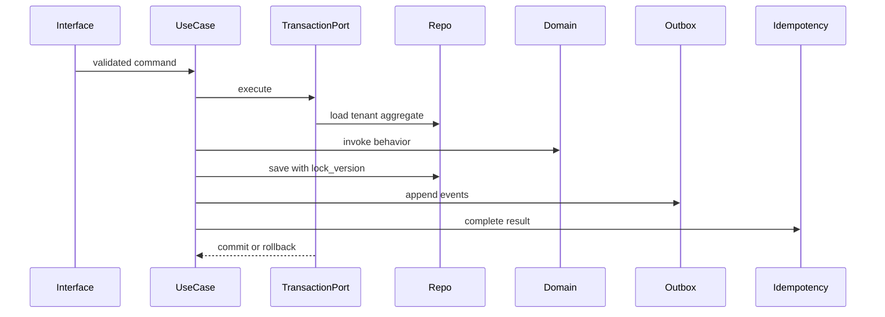

# System Architecture

Status: **Implemented**

## Platform

AutomateX is a Next.js and TypeScript application backed by Supabase PostgreSQL/Auth/RLS. Prisma is
the server-side data access layer. Vitest covers TypeScript behavior and pgTAP covers PostgreSQL
contracts and tenant isolation.

## Logical layers

| Layer          | Owns                                                   | Must not own                          |
| -------------- | ------------------------------------------------------ | ------------------------------------- |
| Domain         | aggregates, Value Objects, invariants, Domain Services | Prisma, HTTP, UI, cross-context logic |
| Application    | use cases, commands, queries, ports, transactions      | business rules, SQL, HTTP DTOs        |
| Infrastructure | Prisma repositories, clocks, outbox, external adapters | business decisions                    |
| Interfaces     | route parsing, auth entry, response mapping, UI        | domain rules                          |
| Composition    | provider construction and dependency injection         | behavior or orchestration             |

## Canonical enterprise flow

```mermaid
flowchart LR
  D["Discovery"] --> I["Adaptive Interview"]
  D --> K["Enterprise Knowledge"]
  I --> K
  K --> P["Process Mapping"]
  P --> B["Business Analysis"]
  B --> AI["AI Opportunity"]
  AI --> AO["Automation Opportunity"]
  AO --> R["ROI"]
  R --> REC["Recommendation"]
  REC --> SD["Solution Designer"]
  SD --> AS["Automation Specification"]
  AS --> AG["Automation Generator"]
```

V1 through Recommendation, Solution Designer and Automation Specification are Implemented.
Automation Generator is In Progress: Domain, Application, Infrastructure and Composition are
Implemented; real graph compilation and public REST interfaces are Planned.

## Persistence

`supabase/migrations` defines the database. Prisma models mirror the schema for typed server access.
Tenant-owned records carry `organization_id`; RLS and application filtering are defense in depth.
Lifecycle constraints that protect immutable states are also enforced in PostgreSQL where the
bounded-context contract requires it.

## Command transaction

## Known divergence

The historical [`docs/ARCHITECTURE.md`](../ARCHITECTURE.md) contains status language predating the
completed V1 engines and V2 work. It remains useful for detailed context, but `PROJECT_STATE.md`
now controls status. Consolidation of that long-form document is Planned and must not alter frozen
architecture contracts.
