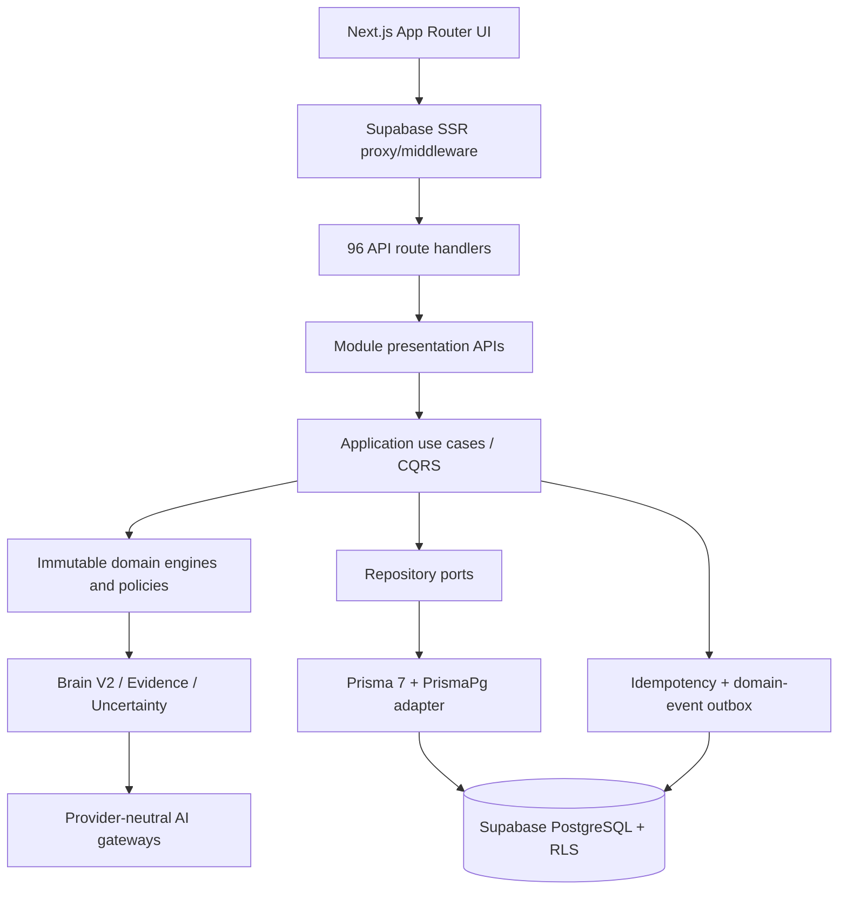

# AutomateX — Architecture Map

Classification: **CURRENT EVIDENCE — READ WITH CURRENT STATUS CONTEXT**

## Runtime topology

## Bounded-context inventory

| Context                                             | Responsibility                                        | Persistence/edge                              |
| --------------------------------------------------- | ----------------------------------------------------- | --------------------------------------------- |
| Companies / Audits                                  | Tenant-scoped enterprise and audit lifecycle          | Prisma + Supabase RLS                         |
| Discovery / Interviews / Questionnaires             | Evidence acquisition and adaptive questioning         | Prisma + RLS                                  |
| Knowledge / Process Mapping                         | Canonical enterprise/process representations          | Prisma + RLS                                  |
| Business Analysis / Opportunities / ROI             | Deterministic analysis and economics                  | Prisma + RLS                                  |
| Recommendations / Solution Designer / Specification | Decision and implementation artifacts                 | Prisma + RLS                                  |
| Automation Generator                                | Generation commands, idempotency, outbox              | Prisma + RLS                                  |
| Brain V2 / Work Intelligence / AI Opportunities     | Evidence, claims, uncertainty, semantic qualification | Mostly application/domain; persistence varies |
| Pilot Dashboard / Reports / Executive Results       | Read models and presentation                          | API + Prisma                                  |

## Request and tenant flow

1. Browser request enters `proxy.ts`.
2. Supabase SSR client refreshes/validates claims and cookies.
3. Membership is checked for protected paths; unauthenticated users redirect to `/login`.
4. Route delegates to a module presentation API.
5. API resolves claims and opens `withAuthenticatedDatabase` transaction.
6. Transaction sets JWT subject and authenticated role; repository predicates and PostgreSQL RLS provide defense in depth.

## Architectural strengths

- Domain code is generally isolated from HTTP/Prisma.
- Module-specific repository adapters make persistence replaceable.
- Immutable value objects and deterministic engines are widely used.
- Outbox/idempotency patterns exist for generator commands.

## Architectural risks

- The branch is a cumulative product history rather than a narrow release branch (124 commits ahead of `main`).
- Auth/data access is centralized but not mechanically proven for every route.
- Runtime infrastructure and AI provider paths coexist with legacy benchmark scripts; ownership boundaries need release documentation.
- No external connector execution was evidenced; generator output should not be mistaken for live automation execution.
